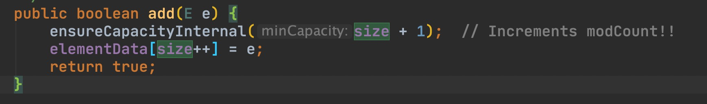
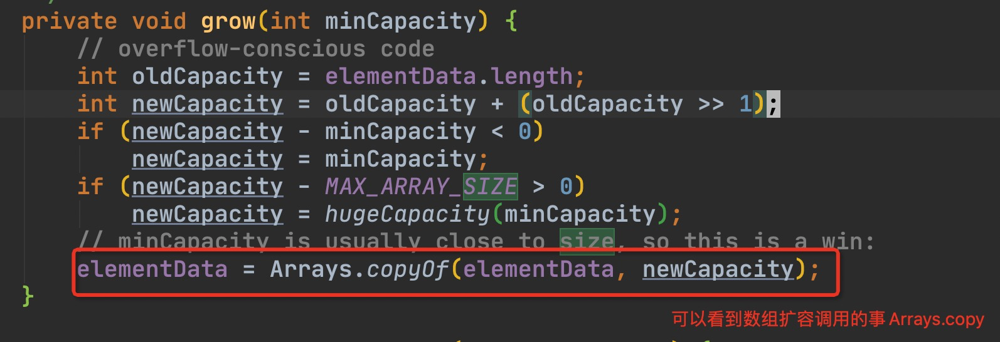

ArrayList初始容量及扩容机制

Q1: ArrayList的默认容量为多大?

A1: 初始默认容量10

Q2: 何时申请空间?

A2: 第一次进行元素add时

Q3: ArrayList如何扩容

A3: 扩容原来大小的一半，公式 newSize = oldSize + oldSize / 2

分析

1.查看ArrayList源码，ArrayList无参构造函数并没有对容器进行初始化只赋值了一个空数组

2.查看add方法，可看到在ensureCapacityInternal方法中会初始化数组或数组扩容

